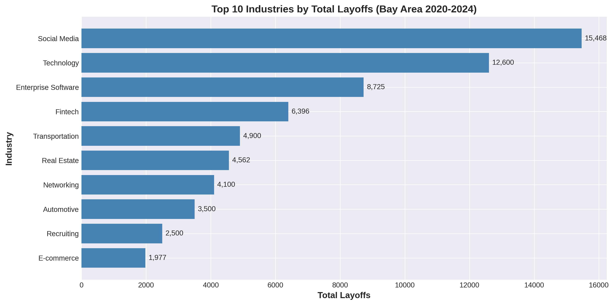
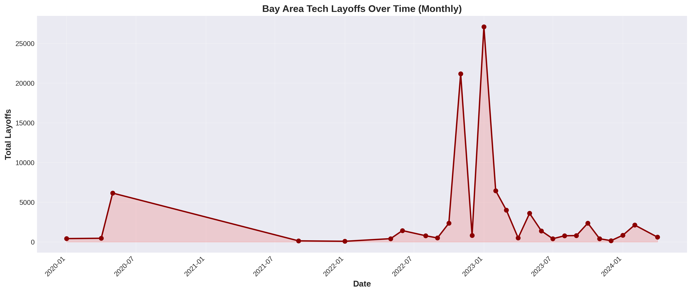
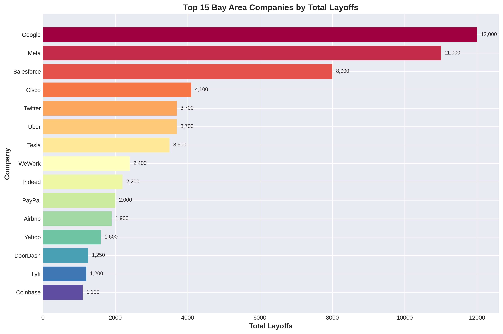
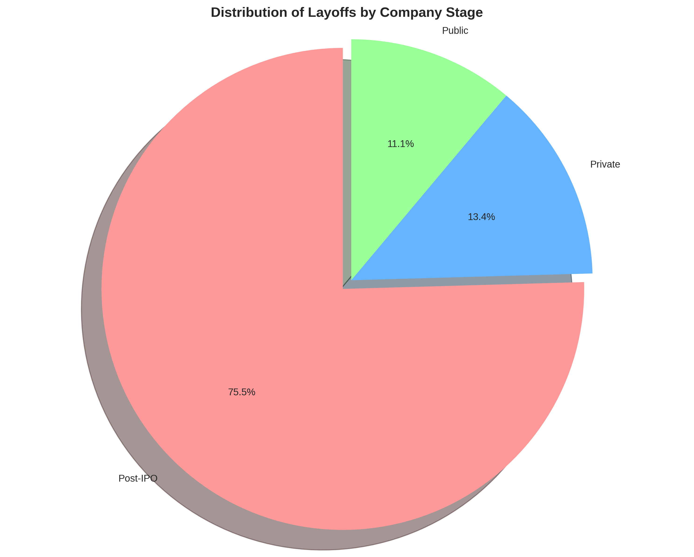
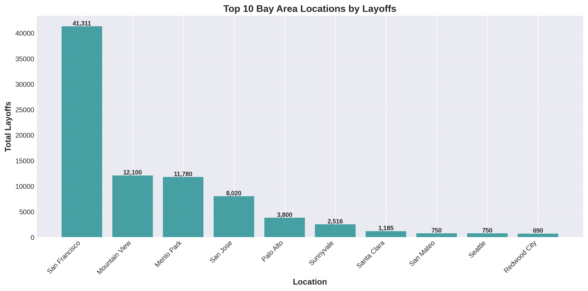
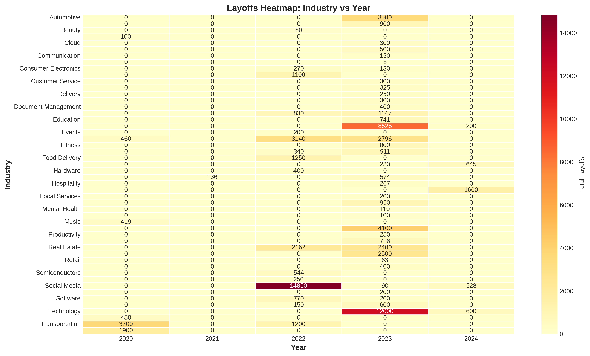

# Bay Area Tech Layoffs Analysis (2020-2024)

Data analysis project examining tech layoffs in the San Francisco Bay Area from 2020-2024. Analyzed 86,207 layoffs across 100 companies to identify trends and patterns.

## Overview

This project looks at tech layoff data to understand which companies, industries, and locations were most affected during the 2020-2024 period. The analysis uses Python for data processing and SQL for querying patterns.

**Key findings:**
- 2023 was the worst year with 47,933 layoffs (56% of total)
- San Francisco accounted for 48% of all Bay Area layoffs
- Post-IPO companies had 75% of layoffs despite being more established
- Social media industry was hit hardest with 15,468 total layoffs

## Data

Dataset includes 100 Bay Area tech companies with information on:
- Company name, location, and industry
- Number of employees laid off
- Percentage of workforce affected
- Date of layoffs
- Company stage and funding

## Tools Used

- Python (Pandas, NumPy, Matplotlib, Seaborn)
- SQL (SQLite)
- Jupyter Notebook

## Project Structure

```
├── README.md
├── analysis.ipynb          # Main analysis notebook
├── layoffs_data.csv        # Dataset
├── requirements.txt        # Python dependencies
├── sql_queries.sql         # Example queries
└── visualizations/         # Charts and graphs
```

## Analysis Highlights

**Temporal trends:**
- 2020: 7,029 layoffs (pandemic impact)
- 2022: 27,536 layoffs (downturn begins)
- 2023: 47,933 layoffs (peak)
- 2024: 3,573 layoffs (recovery starting)

**Geographic breakdown:**
- San Francisco: 41,311 (48%)
- Mountain View: 12,100 (14%)
- Menlo Park: 11,780 (14%)
- San Jose: 8,020 (9%)

**Top affected industries:**
- Social Media: 15,468
- Technology: 12,600
- Enterprise Software: 8,725
- Fintech: 6,396

**Largest layoffs by company:**
- Google: 12,000
- Meta: 11,000
- Salesforce: 8,000

## Visualizations

The project includes six visualizations showing different aspects of the data:

### Industry Impact


### Timeline


### Top Companies


### Company Stage Distribution


### Geographic Distribution


### Industry-Year Heatmap


## Running the Analysis

Install dependencies:
```bash
pip install -r requirements.txt
```

Open the Jupyter notebook:
```bash
jupyter notebook analysis.ipynb
```

Or run all cells to regenerate the analysis and visualizations.

## SQL Queries

The sql_queries.sql file contains example queries used in the analysis, including:
- Top companies by layoffs
- Industry breakdown over time
- Year-over-year comparisons
- Geographic patterns

## Insights

A few interesting observations from the data:

1. The layoff wave peaked in early 2023, particularly in Q4 2022 and Q1 2023
2. Contrary to expectations, mature Post-IPO companies cut deeper than startups
3. San Francisco's concentration of tech companies made it the epicenter
4. The recovery started in 2024 with significantly fewer layoffs

## Setup

Clone the repository:
```bash
git clone https://github.com/hrinaldi/bay-area-tech-layoffs-analysis.git
cd bay-area-tech-layoffs-analysis
```

Install requirements:
```bash
pip install -r requirements.txt
```

## Contact

Hasan Rinaldi

LinkedIn: https://www.linkedin.com/in/hasan-rinaldi-bb0186253/

Email: hasan.rinaldi13@gmail.com
